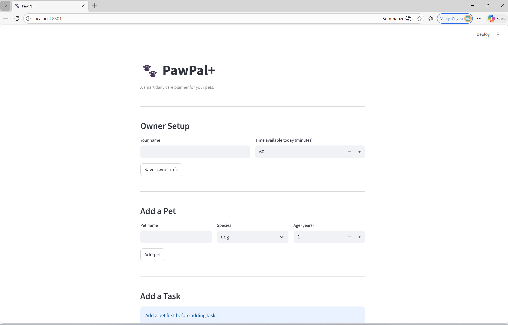

# 🐾 PawPal+

A smart daily care planner for pet owners. PawPal+ helps you stay consistent with pet care by generating a prioritized schedule based on your available time, your pets' needs, and task urgency.

---

## 📸 Demo

<a href="/course_images/ai110/pawpal_screenshot.png" target="_blank">
  
</a>

---

## Scenario

A busy pet owner needs help staying consistent with pet care. They want an assistant that can:

- Track pet care tasks (walks, feeding, meds, enrichment, grooming, etc.)
- Consider constraints (time available, priority, owner preferences)
- Produce a daily plan and explain why it chose that plan

---

## ✨ Features

**Owner and pet management**
Register an owner with a daily time budget and add multiple pets. Each pet maintains its own task list independently.

**Task creation**
Add care tasks with a name, duration, priority (High / Medium / Low), category, preferred time slot, frequency, and an optional description.

**Priority-based scheduling**
The scheduler sorts tasks by priority first, then by duration (Shortest Job First) as a tiebreaker. This maximises the number of tasks that fit within the owner's available time window. Tasks that don't fit are listed as skipped with a clear reason.

**Sort by time**
All tasks are displayed in chronological order by preferred start time, giving the owner a realistic view of how their day will flow.

**Filter by pet**
The task view can be filtered to show only one pet's tasks, making it easy to focus on a specific animal's care needs.

**Conflict detection**
Before displaying the task list or generating a plan, the scheduler checks every pair of tasks for time window overlaps. Conflicts are surfaced as visible warnings so the owner can fix them before running the schedule.

**Recurring tasks**
Each task has a frequency: `daily`, `weekly`, or `as_needed`. When a daily or weekly task is marked complete, a new instance is automatically created for the next due date using Python's `timedelta`. Tasks marked `as_needed` do not auto-recur.

**Senior pet indicator**
Pets are automatically flagged as senior based on species-specific age thresholds, giving owners a reminder to consider additional care needs.

**Reasoning log**
Every generated plan includes a plain-text log explaining why each task was scheduled or skipped, so the owner can trust and understand the output.

---

## 🗂 Project Structure

```
pawpal_system.py   — Core classes: Owner, Pet, Task, Scheduler, DailyPlan
app.py             — Streamlit UI
main.py            — Terminal demo and manual testing
tests/
  test_pawpal.py   — Automated pytest suite (14 tests)
uml_final.png      — Final class diagram
reflection.md      — Design decisions and tradeoffs
```

---

## 🚀 Getting Started

```bash
python -m venv .venv
source .venv/bin/activate   # Windows: .venv\Scripts\activate
pip install -r requirements.txt
streamlit run app.py
```

---

## 🧪 Testing PawPal+

Run the full test suite from the project root:

```bash
python -m pytest -v
```

**What the tests cover:**

- Task completion — verifying `mark_complete()` updates `is_completed` correctly
- Pet task management — confirming `add_task()` increases the pet's task count
- Sorting correctness — ensuring `sort_by_time()` returns tasks in chronological order regardless of insertion order
- Recurrence logic — confirming daily and weekly tasks auto-generate a next occurrence on completion, and that `as_needed` tasks do not
- Conflict detection — verifying the scheduler flags both exact same-start and partial time overlaps, and produces no false positives for non-overlapping tasks
- Edge cases — empty task lists, tasks that exceed available time, a task that fits exactly, and filtering by a pet name that doesn't exist

**Confidence level: ★★★★☆**

Core scheduling behaviors are well covered and all 14 tests pass. The one-star gap reflects areas not yet tested: preference-aware scheduling, multi-pet time budget splitting, and UI-layer behavior in `app.py`.

---

## 🧠 Smarter Scheduling

**Sort by time.** `sort_by_time()` orders tasks by their preferred start time using `HH:MM` string comparison. Because times are zero-padded, lexicographic order matches chronological order — no datetime parsing needed.

**Filter by pet or status.** `filter_by_pet()` returns tasks belonging to a single named pet. `filter_by_status()` returns all tasks across every pet that are either complete or incomplete.

**Recurring tasks.** Every `Task` has a `frequency` field (`daily`, `weekly`, or `as_needed`) and a `due_date`. When `mark_task_complete()` is called on a daily or weekly task, `clone_for_next_occurrence()` automatically creates a fresh copy scheduled for the next due date using Python's `timedelta`. Tasks marked `as_needed` are completed without spawning a follow-up.

**Conflict detection.** `detect_conflicts()` checks every pair of tasks using `itertools.combinations` and flags any two whose time windows overlap. The overlap condition is `start_A < end_B and start_B < end_A`, which catches both exact same-start collisions and partial overlaps. Warnings are returned as a list of strings so the app can display them without crashing.