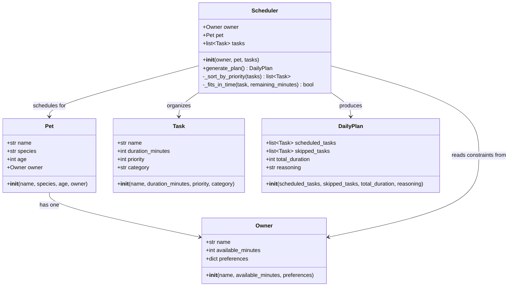

# PawPal+ Class Diagram

```mermaid
classDiagram
    class Owner {
        +str name
        +int available_minutes
        +dict preferences
        +__init__(name, available_minutes, preferences)
    }

    class Pet {
        +str name
        +str species
        +int age
        +Owner owner
        +__init__(name, species, age, owner)
    }

    class Task {
        +str name
        +int duration_minutes
        +int priority
        +str category
        +__init__(name, duration_minutes, priority, category)
    }

    class Scheduler {
        +Owner owner
        +Pet pet
        +list~Task~ tasks
        +__init__(owner, pet, tasks)
        +generate_plan() DailyPlan
        -_sort_by_priority(tasks) list~Task~
        -_fits_in_time(task, remaining_minutes) bool
    }

    class DailyPlan {
        +list~Task~ scheduled_tasks
        +list~Task~ skipped_tasks
        +int total_duration
        +str reasoning
        +__init__(scheduled_tasks, skipped_tasks, total_duration, reasoning)
    }

    Pet --> Owner : has one
    Scheduler --> Owner : reads constraints from
    Scheduler --> Pet : schedules for
    Scheduler --> Task : organizes
    Scheduler --> DailyPlan : produces
```
